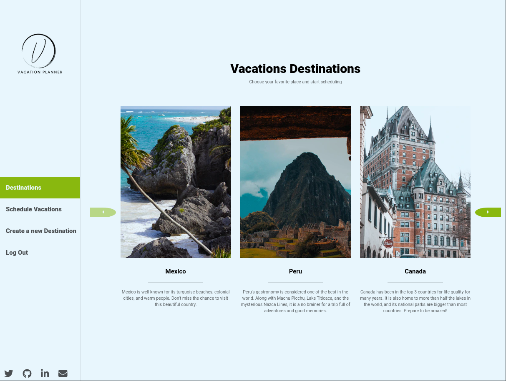
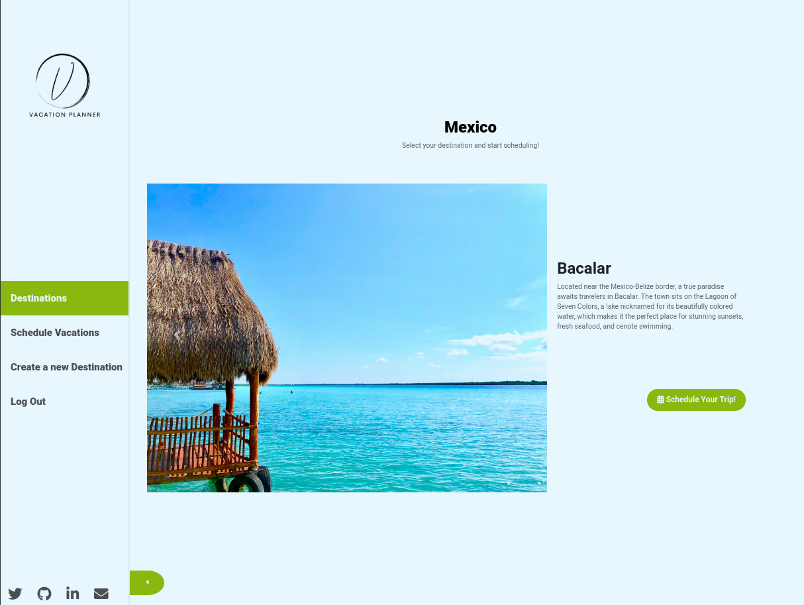
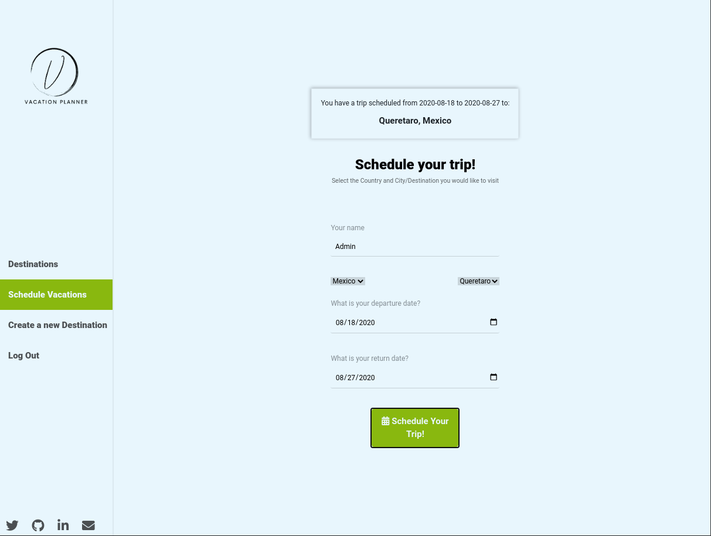
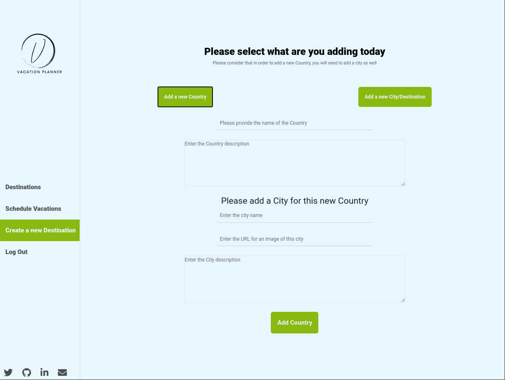

# Vacation Planner

[![Contributors][contributors-shield]][contributors-url]
[![Forks][forks-shield]][forks-url]
[![Stargazers][stars-shield]][stars-url]
[![Issues][issues-shield]][issues-url]

Vacation Planner is an app that allows you to schedule your vacations. You can browse through the supported countries and then select the destination you would like to visit. It also offers some interesting facts about each place and beautiful images for you to have a preview of what is waiting for you.







> This project includes an admin account to add new countries and cities! The limit is your imagination!



> On this project, I used a Full-Stack Ruby-on-Rails-React stack. I used Ruby on Rails API architecture with Fast JSON API for the serialization of information to get sent to the front end, and Bcript for user authentication and password encryption. I implemented the front end using React/Redux and React-Bootstrap. Redux handles the store that the application needs to share all across, and React Hooks the state of components that do not; this keeps the store clean and optimized.

## Live Version

[Vacation Planner](https://vacation-planner-ror-react.herokuapp.com/)

## Built With

- Ruby v2.6.5
- Ruby on Rails v6.0.3.1
- React 16.13.1
- Redux 4.0.5
- React-Redux
- Bcrypt
- Fast JSON API
- Bootstrap 4
- Fontawesome
- SASS

### Testing

- Jest
- RSpec
- Capybara
- Enzyme
- Factory Bot
- Faker

## Getting Started

To get started with the app, cd to the directory where you would like the repo to live by typing on your terminal:

```
$ cd <directory>
```

Clone the repo typing:

```
$ git clone git@github.com:lmaldonadoch/vacation-planner.git.git
```

Install the needed gems:

```
$ bundle install
```

Now, set up the database. For a better user experience and to have access to the admin account, I recommend the use of the seed file. You can create the database and install the seed file with:

```
$ rails db:setup

```

If you would like to start with a clean database instead, you can run:

```
$ rails db:migrate
```

Finally, start server:

```
$ rails server
```

Open `http://localhost:3000/` in your browser.

### Functionality:

The prebuilt database contains 3 accounts:

- Admin
  - email: admin@vacationplanner.com
  - password: 123456
- Luis
  - email: luis@vacationplanner.com
  - password: 123456
- Carlos
  - email: carlos@vacationplanner.com
  - password: 123456

6 Countries and 18 destinations.

From the admin account you can create new cities and destinations. To do it, just log in using the admin account, and click on the "Create a new Destination" Tab on the left side navbar.

### Prerequisites

Ruby: >= 2.6.5
Rails: >= 6.0.0
Postgres: >= 9.5
Node: >= 14.0

## Run tests

> To run the tests, please make sure you are in the root directory of the project.

### Server side testing:

#### Controllers

```
  rspec spec/controllers/destinations_spec.rb

  rspec spec/controllers/images_spec.rb

  rspec spec/controllers/registrations_spec.rb

  rspec spec/controllers/sessions_spec.rb

  rspec spec/controllers/vacation_dates_spec.rb
```

#### Models

```
  rspec spec/models/destinations_spec.rb

  rspec spec/models/images_spec.rb

  rspec spec/models/users_spec.rb

  rspec spec/models/vacation_dates_spec.rb
```

### Front-end React Components Testing

```
npx jest
```

## Author

👤 **Luis Angel Maldonado**

- Github: [@lmaldonadoch](https://github.com/lmaldonadoch)
- Twitter: [@LuisAngelMCh](https://twitter.com/LuisAngelMCh)
- Linkedin: [LinkedIn](https://www.linkedin.com/in/lmaldonadoch)

## Future Upgrades

- Detail further mobile version
- Add Delete/Edit functionality
- Add flight tickets search functionality
- Add tours search functionality

## 🤝 Contributing

Contributions, issues and feature requests are welcome!

Feel free to check the [issues page](https://github.com/lmaldonadoch/vacation-planner/issues).

## Show your support

Give a ⭐️ if you like this project!

## Acknowledgments

- Project requested by [Microverse Program](https://www.microverse.org/).
- The project design and original idea are from [Murat Korkomaz](https://www.behance.net/muratk). Big cheers to him! You can find the complete project on [this Behance link](hhttps://www.behance.net/gallery/26425031/Vespa-Responsive-Redesign).
- Most of the cities and countries descriptions were taken from [Trip Advisor](https://www.tripadvisor.com/).

<!-- MARKDOWN LINKS & IMAGES -->

[contributors-shield]: https://img.shields.io/github/contributors/lmaldonadoch/vacation-planner.svg?style=flat-square
[contributors-url]: https://github.com/lmaldonadoch/vacation-planner/graphs/contributors
[forks-shield]: https://img.shields.io/github/forks/lmaldonadoch/vacation-planner.svg?style=flat-square
[forks-url]: https://github.com/lmaldonadoch/vacation-planner/network/members
[stars-shield]: https://img.shields.io/github/stars/lmaldonadoch/vacation-planner.svg?style=flat-square
[stars-url]: https://github.com/lmaldonadoch/vacation-planner/stargazers
[issues-shield]: https://img.shields.io/github/issues/lmaldonadoch/vacation-planner.svg?style=flat-square
[issues-url]: https://github.com/lmaldonadoch/vacation-planner/issues
